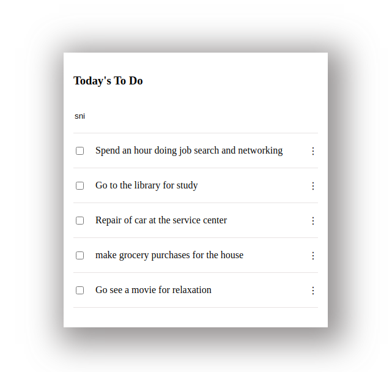

# Todo List

"To-do list" is a tool that helps to organize your day. It simply lists the things that you need to do and allows you to mark them as complete.

## Live Demo
[Todo List App](https://reverent-clarke-8b4656.netlify.app/)

### Project requirements
- Set up a new project with webpack that is based on the webpack exercise you have already completed.
- Create an **index.html** file and write your HTML markup here. Create an empty **To Do List** placeholder (`
` or `<ul>` element). The **index.html** file must be set as a template using the *HTML Webpack Plugin*.
- Create an **index.js** file and set an array of some simple *to do tasks* (array of objects). Each task object should contain three keys: 
  1. description [`string`].
  2. completed [`bool`].
  3. index: [`number`].
- Write a function to iterate over the tasks array and populate an HTML list item element for each task.
- On page load render the dynamically created list of tasks in the dedicated placeholder. The list should apear in order of the `index` values for each task.
- Create a **style.css** and set rules for the **To Do List**. CSS must be loaded by *Webpack Style/CSS Loader*. Your list should be a clone of the part of the minimalist project captured in the video below.
- All your source files (**index.html**, **index.js** and **style.css**) must be located in */src* directory and your distribution files will be generated by webpack and served by *webpack dev server* from */dist* folder.
need to use only one repository for your pair-programming group.

## Built With

- Webpack
- Linters included: (Lighthouse, Webhint, Stylelint)
- Features of webpack and plugins already inlcuded 
   1. style-loader
   2. css loader
   3. HtmlWebpackPlugin
   4. WebPack Dev Server
   

## Usage

1. Navigate to your desired directory in your local machine using the terminal.

2. Clone repository by running `git clone git@github.com:AdedayoOpeyemi/todo-list.git` in your local terminal

3. Run the following command to install the needed dependencies

    `npm install`

4. Use the following commands to 
   `npm run start` to start the Webpack Dev server and serve the files from the dist directory
   `npm run build` to complile build all source files into the dist directory
   `npm run watch` to set webpack into watch mode so that the build is automatically run whenever changes are made to any of the source files.

## Authors

👤 **Opeyemi Oyelesi**

- Github: [@Adedayoopeyemi](https://github.com/Adedayoopeyemi)
- Twitter: [@oyelesiopy](https://twitter.com/oyelesiopy)
- Linkedin: [linkedin](https://linkedin.com/opeyemioyelesi)

## 🤝 Contributing

Contributions, issues, and feature requests are welcome!

Feel free to check the [issues page](https://github.com/AdedayoOpeyemi/todo-list/issues).

## Show your support

Give a ⭐️ if you like this project!
